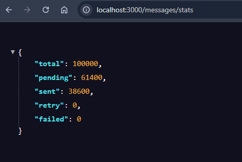
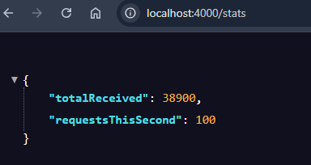
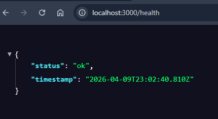

# MSG Delivery Gateway

Gateway asíncrono que absorbe ráfagas de mensajes de alto volumen y los entrega a un proveedor externo respetando su rate limit estricto de 100 msg/s, sin perder ninguno.

---

## El problema que resuelve

Cuando Plataforma A manda 100,000 mensajes en 35 segundos y Plataforma C solo acepta 100 por segundo, alguien tiene que estar en medio absorbiendo la presión. Ese es este servicio.

```
Plataforma A ──► [Gateway :3000] ──► Plataforma C :4000
  100k msgs           cola              max 100/s
  en ~35s           en memoria         respetado
```

---

## Stack elegido

- **Node.js + Express** — base sólida para APIs REST
- **Cola en memoria** — simple, rápida y suficiente para demo
- **setInterval cada 1s** — throttling directo sin librerías externas
- **Docker Compose** — levanta todo con un comando

> No usé Redis, BullMQ ni PostgreSQL porque la prueba indica no over-engineerear.
> La limitación principal de memoria se documenta abajo.

---

## Levantar el proyecto

### Con Docker (recomendado)

```bash
git clone https://github.com/Roxmend0509/msg-delivery-gateway-rmd.git
cd msg-delivery-gateway-rmd
cp .env.example .env
docker-compose up --build
```

Servicios disponibles:
- Gateway → http://localhost:3000
- Mock Plataforma C → http://localhost:4000

### Sin Docker

```bash
npm install

# Terminal 1
npm run mock

# Terminal 2
npm run dev
```

---

## Simular la ráfaga de 100,000 mensajes

```bash
# Terminal 3
npm run simulate
```

### Resultado de la simulación


### Stats del Gateway en tiempo real


### Health Check


---

## Endpoints

| Método | Ruta | Descripción |
|--------|------|-------------|
| POST | /messages | Recibe mensaje de Plataforma A |
| GET | /messages/stats | Estado global de la cola |
| GET | /messages/:id | Estado de un mensaje específico |
| GET | /health | Health check |

### POST /messages

```json
// Request
{
  "id": "uuid-opcional",
  "content": "texto del mensaje",
  "recipient": "usuario@email.com"
}

// Response 202
{
  "message": "Mensaje recibido y en cola",
  "id": "uuid",
  "duplicate": false
}
```

### GET /messages/stats

```json
{
  "total": 100000,
  "pending": 0,
  "sent": 99800,
  "retry": 200,
  "failed": 0
}
```

---

## Cómo funciona por dentro

### 1. Recepción asíncrona
El endpoint POST responde de inmediato con 202 — no espera a que el mensaje llegue a C. Plataforma A nunca se bloquea.

### 2. Throttling
Un setInterval se ejecuta cada 1000ms y procesa máximo 100 mensajes pendientes. Si C responde 429, el mensaje se marca para reintento automático.

### 3. Reintentos
Cada mensaje tiene un contador de intentos. Después de 3 fallos consecutivos pasa a estado failed. Los mensajes en retry se procesan en el siguiente tick.

### 4. Idempotencia
Antes de agregar un mensaje a la cola se verifica su ID en un Set. Si ya existe, se rechaza sin duplicar.

---

## Preguntas de diseño

**1. Como garantizas que ningun mensaje se pierda si el proceso se reinicia?**

Con la implementación actual no se garantiza — es la limitación más importante. En producción usaría Redis con AOF persistence para que los mensajes sobrevivan reinicios. Lo documento porque prefiero ser honesta sobre los trade-offs que fingir que no existen.

**2. Como escalarías a multiples instancias?**

Con cola en memoria no es posible — cada instancia tendría su propia cola. La solución sería mover la cola a Redis y usar SETNX para que solo una instancia procese cada mensaje. BullMQ hace esto de forma nativa.

**3. Cuando necesitarías priorización?**

Cuando no todos los mensajes tienen el mismo peso — por ejemplo OTPs bancarios versus newsletters. Implementaría múltiples colas con workers dedicados por prioridad.

---

## Limitaciones conocidas

- Cola en memoria — los mensajes no sobreviven un reinicio del proceso
- Sin autenticación en los endpoints
- El throttler no es distribuido — no escala horizontalmente sin cambiar el mecanismo de cola

---

## Autor

**Roxana Mendoza Díaz**
Fullstack Developer | Node.js · AWS · Vue.js · React
rox050996@gmail.com